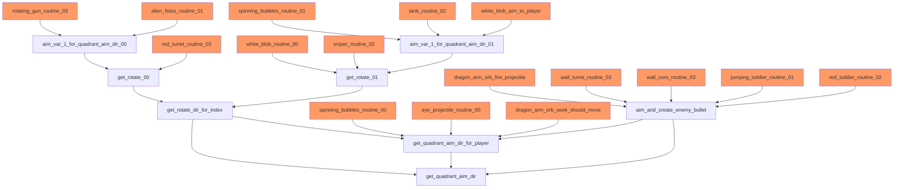

# Aiming

16 enemies aim towards the player to target them.  Some of those enemies, for
example a sniper (enemy type = #$06), will aim towards the closest player and
fire bullets.  Others will track the player actively.  For example, the white
blobs (enemy type = #$13) will follow the player for a specified amount of time.
Note that some enemies will fire, but they aren't aiming like the scuba soldier,
or even the regular soldier.

Some enemies can aim in more directions than others.  For example, snipers
(enemy type = #$06) can aim in #$17 directions, whereas rotating guns (enemy
type = #$04) can only aim in #$0b directions.  The number of directions that an
enemy can aim are determined by which table is used when aiming.

* `quadrant_aim_dir_00` is used for outdoor enemies and has #$03 aiming
  directions per quadrant for a total of #$0b aiming directions.
* `quadrant_aim_dir_01` is used for all indoor/base enemies, tank, sniper, white
  blob and spinning bubbles.  The table has values #$06 aiming directions per
  quadrant for a total of #$17 aiming directions.
* `quadrant_aim_dir_02` is only used by dragon arm when seeking (stage 3 boss)
  and has #$0f aiming directions per quadrant for a total of #$3b aiming
  directions.

Aiming direction values start at #$00, which represents 3 o'clock.  Incrementing
the aiming directions moves the direction clockwise.

The main method to determine what value within a quadrant to aim is
`get_quadrant_aim_dir`.  I refer to this value as the "quadrant aim direction"
as specifies the index within a quadrant to aim.  The quadrant aim direction
along with the quadrant is combined to determine the full aim direction.

The `get_quadrant_aim_dir` method targets the location ($0b, $0a) from position
($09, $08).  This location is almost always the location of the closest player
to the enemy on the x-axis, which is determined by the method
`player_enemy_x_dist`.  However, white blobs (enemy type = #$13) will target
players randomly based on the frame counter.  `get_quadrant_aim_dir` determines
where the player is in relation to the enemy, i.e. above or below, to the left
or to the right.  It will also calculate an index into a single quadrant that
most closely targets the player position based on `quadrant_aim_dir_xx`.  The
quadrant aim direction is then converted to a full aim direction according to
the table below. Essentially, the quadrant code is either added or subtracted
from the x-axis aim direction depending on the relative quadrant of the player
in relation to the enemy.

| Quadrant | Math                                                  | Description                                    |
|----------|-------------------------------------------------------|------------------------------------------------|
| I        | new_aim_dir = max_aim_dir - new_aim_dir               | result subtracted from 3 o'cock aim direction  |
| II       | new_aim_dir = max_aim_dir - mid_aim_dir + new_aim_dir | result added to 9 o'clock aim direction        |
| III      | new_aim_dir = mid_aim_dir - new_aim_dir               | result subtracted from 9 o'clock aim direction |
| IV       | new_aim_dir                                           | no math                                        |

Many enemies will use the full aim direction value to set their graphic to the
appropriate value.  For example, the rotating gun will take the calculated full
aim direction from `aim_var_1_for_quadrant_aim_dir_00`, adjust it by adding or
subtracting, then setting the super-tile to the value as an offset into
`level_xx_nametable_update_supertile_data`.

## Bullets

When creating bullets, the value returned by `get_quadrant_aim_dir` is converted
into the full aim direction.  Then the full aim direction is used by
`calc_bullet_velocities` as an offset into `bullet_fract_vel_dir_lookup_tbl`.
This value is then used as an offset into `bullet_fract_vel_tbl`.  These values,
along with the bullet speed code and quadrant, are used to determine the bullet
x and y velocities.

For most enemy generated bullets, the method `aim_and_create_enemy_bullet` is
used.  This method calls `get_quadrant_aim_dir` and `calc_bullet_velocities`.
However, some enemies instead call `get_quadrant_aim_dir_for_player` directly
and then call `calc_bullet_velocities` separately to set the bullet velocities.

| Enemy                         | Type | Calling Method                    |
|-------------------------------|------|-----------------------------------|
| Wall Turret                   | #$13 | `aim_and_create_enemy_bullet`     |
| Core                          | #$14 | `aim_and_create_enemy_bullet`     |
| Dragon Tentacle Orb           | #$15 | `aim_and_create_enemy_bullet`     |
| Jumping Soldier               | #$16 | `aim_and_create_enemy_bullet`     |
| Boss Eye Fire Ring Projectile | #$1b | `get_quadrant_aim_dir_for_player` |
| Gardegura                     | #$1d | `get_quadrant_aim_dir_for_player` |
| Rangel                        | #$1f | `aim_and_create_enemy_bullet`     |

All of the enemies using this pattern to create bullets use
`quadrant_aim_dir_01`, which gives quadrant offsets between 0-6
inclusively.  Since each quadrant has 6 values, there are 24 (#$18) possible
aim directions.  Below is the table that is used to to determine the velocity
from the calculated full aim direction.  Once the velocity is obtained from this
table, the quadrant is incorporated to adjust the signs (+/-) on the direction.
Finally, the velocity is adjusted again based on bullet speed code
(`adjust_bullet_velocity`).

| `bullet_fract_vel_dir_lookup_tbl` | `bullet_fract_vel_tbl` | x vel        | y vel        | degree off axis |
|-----------------------------------|------------------------|--------------|--------------|-----------------|
| #$00                              | #$00                   | #$ff (.9961) | #$00         | 0°              |
| #$01                              | #$02                   | #$f7 (.9648) | #$42 (.2578) | 15°             |
| #$02                              | #$04                   | #$dd (.8633) | #$80 (.5)    | 30°             |
| #$03                              | #$06                   | #$b5 (.7070) | #$b5 (.7070) | 45°             |
| #$04                              | #$08                   | #$80 (.5)    | #$dd (.8633) | 60°             |
| #$05                              | #$0a                   | #$42 (.2578) | #$f7 (.9648) | 75°             |
| #$06                              | #$0c                   | #$00         | #$ff (.9961) | 90°             |
| #$07                              | #$0a                   | #$42 (.2578) | #$f7 (.9648) | 75°             |
| #$08                              | #$08                   | #$80 (.5)    | #$dd (.8633) | 60°             |
| #$09                              | #$06                   | #$b5 (.7070) | #$b5 (.7070) | 45°             |
| #$0a                              | #$04                   | #$dd (.8633) | #$80 (.5)    | 30°             |
| #$0b                              | #$02                   | #$f7 (.9648) | #$42 (.2578) | 15°             |
| #$0c                              | #$00                   | #$00         | #$ff (.9961) | 90°             |
| #$0d                              | #$02                   | #$f7 (.9648) | #$42 (.2578) | 15°             |
| #$0e                              | #$04                   | #$dd (.8633) | #$80 (.5)    | 30°             |
| #$0f                              | #$06                   | #$b5 (.7070) | #$b5 (.7070) | 45°             |
| #$10                              | #$08                   | #$80 (.5)    | #$dd (.8633) | 60°             |
| #$11                              | #$0a                   | #$42 (.2578) | #$f7 (.9648) | 75°             |
| #$12                              | #$0c                   | #$00         | #$ff (.9961) | 90°             |
| #$13                              | #$0a                   | #$42 (.2578) | #$f7 (.9648) | 75°             |
| #$14                              | #$08                   | #$80 (.5)    | #$dd (.8633) | 60°             |
| #$15                              | #$06                   | #$b5 (.7070) | #$b5 (.7070) | 45°             |
| #$16                              | #$04                   | #$dd (.8633) | #$80 (.5)    | 30°             |
| #$17                              | #$02                   | #$f7 (.9648) | #$42 (.2578) | 15°             |

## Dragon seeking

Dragon Tentacle Orb (enemy type = #$15) is the only enemy type that uses
`quadrant_aim_dir_02`. It uses this during the 'arm seeking player' attack
pattern (attack pattern #$04).  `quadrant_aim_dir_02` has the most precision
with #$0f aim directions per quadrant.

## Aim Call Flow



## Pseudocode

Below is a c-like pseudo-code showing how the quadrant aim direction from
`get_quadrant_aim_dir` value is converted to a full aim direction in
`get_rotate_dir`.

```
int quadrant_aim_dir = get_quadrant_aim_dir();

// mid_aim_dir is 9 o'clock
// max_aim_dir is 3 o'clock
int mid_aim_dir, max_aim_dir, new_aim_dir;
if (quadrant_aim_dir_00 || quadrant_aim_dir_02) {
  mid_aim_dir = 0x06;
  max_aim_dir = 0x0c;
} else {
  mid_aim_dir = 0x0c;
  max_aim_dir = 0x18;
}

if(player_left_of_enemy) {
  new_aim_dir = mid_aim_dir - quadrant_aim_dir;
}

if(player_above_enemy) {
  if(quadrant_aim_dir != 0x00) {
    new_aim_dir = max_aim_dir - new_aim_dir;
  } else {
    new_aim_dir = 0x00;
  }
}

// new full aim direction calculated
new_aim_dir = quadrant_aim_dir;
```