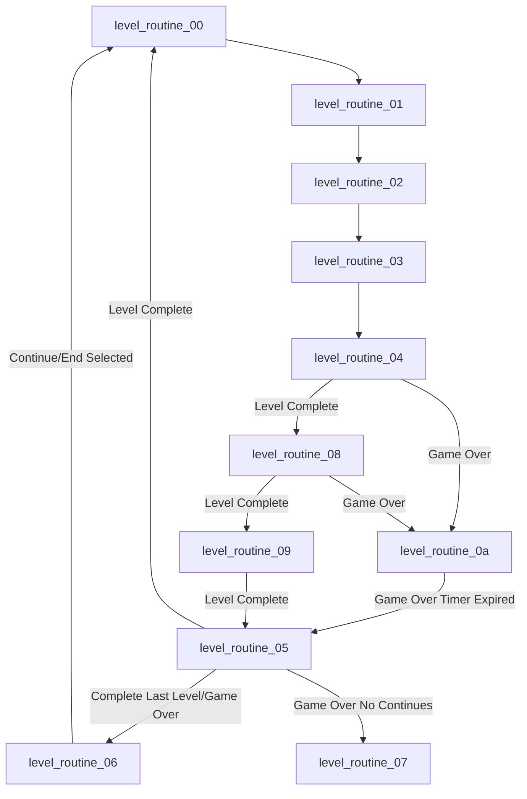

# Game Loop

The control flow of _Contra_ is dictated by the CPU memory address
`GAME_ROUTINE_INDEX` ($18).  You can think of the `game_routine_xx` methods like
canal locks.  As the game progresses, the flow moves to the next
`game_routine`.

  * `game_routine_00` and `game_routine_01` are for setting up the game intro
    and player select UI.
  * `game_routine_02` is for showing the demo.
  * `game_routine_03` loads and auto-plays the demo level
  * `game_routine_04` clears level memory and player-specific memory
  * `game_routine_05` is where majority of level logic is executed
  * `game_routine_06` runs at the end of the game after defeating the final boss
    alien

## game_routine_00
This label is only run once to initialize the NES's graphics and CPU memory that
is used for the introduction animation and player select.

  * Set nametable tiles all to #$00 - `zero_out_nametables` (ROM: $1c9a2, MEM:
    Bank 7 $c9a2)
  * Load intro pattern table, nametable, and palette (`load_intro_graphics`)
  * Reset Komani code number of correct sequence inputs
    (`KONAMI_CODE_NUM_CORRECT`) to back to #$00
  * Initialize the horizontal scroll to #$01 for the sliding intro animation
  * Initialize the high byte of the delay timer that is used for waiting before
    showing the demo

## game_routine_01
This label is executed once per frame repeatedly while the _Contra_ logo is
scrolled across the screen (intro animation).  This label also checks for the
Konami code is checked.  Once the logo is finished scrolling from right to left,
the label will load the sprites needed to show Bill and Lance as well as the
player select UI and cursor.  Then the intro theme music will be played.
Finally, this label waits for both timers to complete before either starting
the game (if the player has made a selection), or show a demo level.

  * Check for Konami code (`konami_input_check`)
  * Scroll intro graphic
    * This is executed repeatedly until scrolling stops, the the logic below is
      executed
  * Load assets after scrolling is complete (`game_routine_01_scroll_complete`)
    * Load player select menu
    * Play intro explosion sound
    * Load sprite for yellow falcon cursor and sprites for Bill and Lance
  * Wait for timer to complete before moving on to `game_routine_02`
    (`dec_theme_delay_check_user_input`)
    * The timer resets if select is pressed

While outside of the `game_routine_01` method, the `exe_game_routine` method
will call `dec_theme_delay_check_user_input` for game routine `game_routine_00`,
`game_routine_01`, and `game_routine_02`.  For `game_routine_01` this method
will

  * decrement timer used to wait for intro theme to play
  * check whether the player has pressed the start button and if so stop the
    intro scrolling animation and show player select UI

## game_routine_02
  * Load demo level and plays the level
  * Stop level when demo timer elapsed and loads next level to demo (only
    levels 0-2)
  * Reset `GAME_ROUTINE_INDEX` to #$0 between demo levels to reshow intro
    scroll and player select

## game_routine_03
This label is executed once the player has pressed start to begin a game while
in `game_routine_02`. It simply ensures the intro theme is finished playing and
then flashes the player selection until all timers are elapsed

  * Wait for intro theme to finish playing
  * Flash "1 PLAYER" or "2 PLAYER" for a bit

## game_routine_04
This label clears level memory and player-specific memory like number of lives,
number of continues, as well as level header data.

  * `init_score_player_lives` - clears memory addresses $0028 to $00f0 then
    `CPU_SPRITE_BUFFER` ($300) up to but not including `CPU_GRAPHICS_BUFFER`
    ($700)

## game_routine_05
This is the where the majority of the game logic is executed from.
`game_routine_05` maintains its own separate set of routines for managing the
level state.  See Level Routines.  There are #$0a level routines.

## game_routine_06
This routine runs at the end of the game after defeating the final boss alien.
Begins the `game_end_routine_XX` routine execution flow and runs through each
routine

  * `game_end_routine_00`
  * `game_end_routine_01`
  * `game_end_routine_02`
  * `game_end_routine_03`
    * `end_game_sequence_00`
    * `end_game_sequence_01`
    * `end_game_sequence_02`
  * `game_end_routine_04`
  * `game_end_routine_05`

# Level Routines
`game_routine_05` maintains a `LEVEL_ROUTINE_INDEX` ($2c). This is an offset
into the `level_routine_ptr_tbl` (ROM: $1ce35, MEM: Bank 7 $ce35). These
routines manage the state of the level as the player progresses. These routines
are not necessarily executed in order like a waterfall. There are #$0a level
routines in total.

These routines manage
  * level initialization
  * showing score before starting a level
  * handle player input, including pause
  * level completion, advancing level
  * game over screen - continue / end
  * game over with no more continues
  * showing game ending sequence

Below is a mermaid diagram of the logic that dictates the state changes among
the level routines.

## level_routine_00
This routine is responsible for loading the level header data into memory.  This
specifies things like what type of level (indoor/base, outdoor), where graphics
data for the level are (super-tile pattern tiles, which super-tiles are on each
screen, and palette data).  Then the routine initializes many PPU write
addresses, and loads the data which specifies the super-tiles on the first
screen.  Note that the actual super-tile pattern tiles aren't loaded into memory
until `level_routine_03`.

  * Load the level header data
  * Load palette for screen that displays number of lives remaining and level/
    stage name.
  * Initialize `BOSS_DEFEATED_FLAG` and `LEVEL_END_PLAYERS_ALIVE` to #$00
  * Call `init_ppu_write_screen_supertiles` to initialize PPU scroll offset,
    PPU write offsets and call `load_current_supertiles_screen_indexes` to
    decompress super-tiles indexes for level's screen to load into CPU memory at
    `LEVEL_SCREEN_SUPERTILES`
  * Loads bank 0 where the enemy routines are and initializes the memory address
    $80 to point to where the enemy routines are for the current level

## level_routine_01
Responsible for displaying the number of lives remaining for players before the
level loads.  This routine does not execute when demoing (in demo mode).  It is
only executed once, whereas `level_routine_02` is executed repeatedly to flash
the score.  The number of lives does not flash.

## level_routine_02
  * Flash the score text until timer elapses
  * Load the theme music for the level `level_vert_scroll_and_song` when not in
    demo mode
  * Sets the vertical scroll

## level_routine_03
Responsible for rendering the nametable super-tiles.

## level_routine_04
  * Sees if the player is pausing or un-pausing by reading input.
  * If the player is pausing, the pause sound is played and the game state is
    updated
  * If the player is paused, then the routine ends
  * Check if BOSS_DEFEATED_FLAG is set, the the current level routine is
    updated to `level_routine_08` and the current routine ends
  * Check if player(s) have entered game over state, and if so, updates the
    current level routine to `level_routine_0a` and the current routine ends
  * Run all enemy logic
  * Run soldier generation
  * Update palette for flashing palettes, see palette cycling documentation in
    `Graphics Documentation.md`
  * Load alternate graphics if necessary

## level_routine_05
Handles when the the level is complete or ended due to game over.  If it's not
the last level, then the sets things up so the next level is loaded. If it's the
last level, then configures things for the end of game sequences. During game
over, after GAME_OVER_DELAY_TIMER elapses, level routine #$0a sets the next
routine to be level_routine_05 so that the game over high score screen can be
shown

  * Clear memory $40 to $f0, then $300 to $600 (exclusively)
  * If game over
    * Load game over screen pattern table and show game over screen
      `show_game_over_screen`
  * Increment `CURRENT_LEVEL`
  * If the last level
    * Start game ending sequence `inc_routine_index_set_timer`
    * Increment `GAME_COMPLETION_COUNT` so next play through is more challenging
    * Reset `LEVEL_ROUTINE_INDEX` back to level_routine_00
  * If not the last level
    * Loads graphics for current score screen and level intro screen in
      `load_level_intro`
    * Increments `LEVEL_ROUTINE_INDEX` to go to level_routine_06
      `inc_routine_index_set_timer`

## level_routine_06
This level routine is the game over screen routine.  It is executed after the
player has died. This routine shows the player scores, the high score. It also
shows the text "GAME OVER" and gives the player the option to either "CONTINUE"
or "END".

  * Display score and "CONTINUE"/"END"
  * Handle player input to change cursor between "CONTINUE" and "END" (select
    button)
  * Handle player input to select either "CONTINUE" and "END" (start button)

## level_routine_07
This routine is executed when there are no continues remaining. It shows the
score and the text "GAME OVER" while waiting for the player to press start. Once
the player presses start, the level routine is set to #$00

`level_routine_07` is executed after checking the number of remaining continues
in `level_routine_05` (`@no_continues_remaining`).

## level_routine_08
Boss destroy animation. Plays level end music

  * Check if player(s) have entered game over state, and if so, updates the
    current level routine to `level_routine_0a` and the current routine ends.
    This seems unlikely as this check happens in `level_routine_04` as well.
    This same code is part of `level_routine_07`, and seems equally unlikely to
    happen for that level routine as well.

## level_routine_09
This routine runs the appropriate level routine from the
`end_level_sequence_ptr_tbl` table.  After each sequence is finished executing,
control is sent back to `level_routine_05`.

 * `end_level_sequence_00`
   * Wait for the players to land if they were jumping
   * Set a small delay before `end_level_sequence_01` does its logic
 * `end_level_sequence_01`
   * Wait for timer to elapse
   * Run level-specific level routine ending animation from
     `end_of_lvl_lvl_routine_ptr_tbl`
 * `end_level_sequence_02`

## level_routine_0a
This is the last level routine, but is executed as part of a game over sequence.
After the player(s) get a game over, this is the routine that waits until
`GAME_OVER_DELAY_TIMER` has elapsed before setting the level routine to #$05
(`level_routine_05`) to reinitialize the level.

The `GAME_OVER_DELAY_TIMER` delay timer starts at #60 and is used to wait a bit
before showing the player scores.