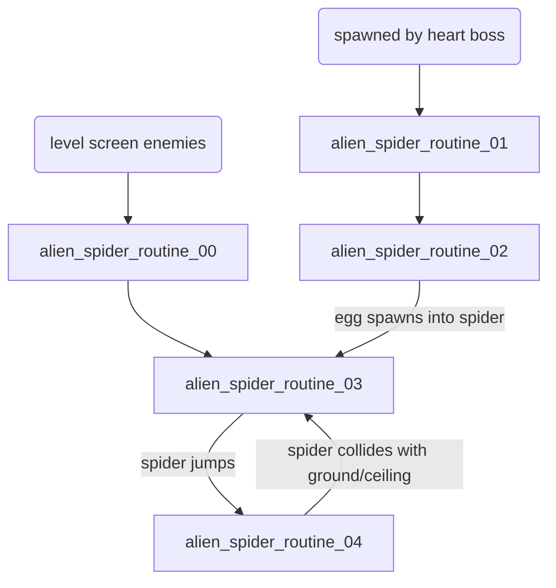

# Enemies

In _Contra_ there are various enemies, each enemy type is assigned a number.
Enemy types whose number is larger than #$0f are level specific.

For outdoor levels, each enemy has 3 bits available to modify their attributes
in some way. For indoor/base levels, and generated enemies, each enemy has an
entire byte for their attributes. This page documents this data as well.

For some enemies, the last bit of the Y position also serves as bit 3 of the
attributes. An odd Y position will make bit 3 of attributes set, and an even Y
position will make bit 3 of attributes clear.  Examples include the pill box
sensor (common), and the claw (hangar).

| Enemy Type | Name                                                                 | Group     |
|------------|----------------------------------------------------------------------|-----------|
| 00         | [Weapon Item](#00---weapon-item)                                     | Shared    |
| 01         | [Bullet](#01---bullet)                                               | Shared    |
| 02         | [Pill Box Sensor](#02---pill-box-sensor)                             | Shared    |
| 03         | [Flying Capsule](#03---flying-capsule)                               | Shared    |
| 04         | [Rotating Gun](#04---rotating-gun)                                   | Shared    |
| 05         | [Soldier](#05---soldier)                                             | Shared    |
| 06         | [Sniper](#06---sniper)                                               | Shared    |
| 07         | [Red Turret](#07---red-turret)                                       | Shared    |
| 08         | [Wall Cannon](#08---wall-cannon)                                     | Shared    |
| 09         | [Unused](#09---unused)                                               | Shared    |
| 0A         | [Wall Plating](#0a---wall-plating)                                   | Shared    |
| 0B         | [Mortar Shot](#0b---mortar-shot)                                     | Shared    |
| 0C         | [Scuba Diver](#0c---scuba-diver)                                     | Shared    |
| 0D         | [Unused](#0d---unused)                                               | Shared    |
| 0E         | [Basquez](#0e---basquez)                                             | Shared    |
| 0F         | [Basquez Bullet](#0f---basquez-bullet)                               | Shared    |
| 10         | [Bomb Turret](#10---bomb-turret)                                     | Level 1   |
| 11         | [Plated Door](#11---plated-door)                                     | Level 1   |
| 12         | [Exploding Bridge](#12---exploding-bridge)                           | Level 1   |
| 10         | [Boss Eye](#10---boss-eye)                                           | Level 2/4 |
| 11         | [Roller](#11---roller)                                               | Level 2/4 |
| 12         | [Grenade](#12---grenade)                                             | Level 2/4 |
| 13         | [Wall Turret](#13---wall-turret)                                     | Level 2/4 |
| 14         | [Core](#14---core)                                                   | Level 2/4 |
| 15         | [Indoor Soldier](#15---indoor-soldier)                               | Level 2/4 |
| 16         | [Jumping Soldier](#16---jumping-soldier)                             | Level 2/4 |
| 17         | [Grenade Launcher](#17---grenade-launcher)                           | Level 2/4 |
| 18         | [Group of Four Soldiers](#18---group-of-four-soldiers)               | Level 2/4 |
| 19         | [Indoor Soldier Generator](#19---indoor-soldier-generator)           | Level 2/4 |
| 1A         | [Indoor Roller Generator](#1a---indoor-roller-generator)             | Level 2/4 |
| 1B         | [Boss Eye Fire Ring Projectile](#1b---boss-eye-fire-ring-projectile) | Level 2/4 |
| 1C         | [Godomuga](#1c---godomuga)                                           | Level 2/4 |
| 1D         | [Gardegura](#1d---gardegura)                                         | Level 2/4 |
| 1E         | [Garth](#1e---garth)                                                 | Level 2/4 |
| 1F         | [Rangel](#1f---rangel)                                               | Level 2/4 |
| 20         | [Garth and Rangel Generator](#20---garth-and-rangel-generator)       | Level 2/4 |
| 10         | [Floating Rock Platform](#10---floating-rock-platform)               | Level 3   |
| 11         | [Moving Flame](#11---moving-flame)                                   | Level 3   |
| 12         | [Rock Cave](#12---rock-cave)                                         | Level 3   |
| 13         | [Falling Rock](#13---falling-rock)                                   | Level 3   |
| 14         | [Dragon](#14---dragon)                                               | Level 3   |
| 15         | [Dragon Tentacle Orb](#15---dragon-tentacle-orb)                     | Level 3   |
| 10         | [Ice Grenade Generator](#10---ice-grenade-generator)                 | Level 5   |
| 11         | [Ice Grenade](#11---ice-grenade)                                     | Level 5   |
| 12         | [Tank](#12---tank)                                                   | Level 5   |
| 13         | [Ice Separator](#13---ice-separator)                                 | Level 5   |
| 14         | [Alien Carrier](#14---alien-carrier)                                 | Level 5   |
| 15         | [Flying Saucer](#15---flying-saucer)                                 | Level 5   |
| 16         | [Drop Bomb](#16---drop-bomb)                                         | Level 5   |
| 10         | [Down Fire Beam](#10---down-fire-beam)                               | Level 6   |
| 11         | [Left Fire Beam](#11---left-fire-beam)                               | Level 6   |
| 12         | [Right Fire Beam](#12---right-fire-beam)                             | Level 6   |
| 13         | [Giant Boss Soldier](#13---giant-boss-soldier)                       | Level 6   |
| 14         | [Spiked Projectile](#14---spiked-projectile)                         | Level 6   |
| 10         | [Claw](#10---claw)                                                   | Level 7   |
| 11         | [Rising Spiked Wall](#11---rising-spiked-wall)                       | Level 7   |
| 12         | [Tall Spiked Wall](#12---tall-spiked-wall)                           | Level 7   |
| 13         | [Mining Cart Generator](#13---mining-cart-generator)                 | Level 7   |
| 14         | [Mining Cart](#14---mining-cart)                                     | Level 7   |
| 15         | [Stationary Mining Cart](#15---stationary-mining-cart)               | Level 7   |
| 16         | [Armored Door](#16---armored-door)                                   | Level 7   |
| 17         | [Mortar Launcher](#17---mortar-launcher)                             | Level 7   |
| 18         | [Soldier Generator](#18---soldier-generator)                         | Level 7   |
| 10         | [Emperor Demon Dragon God Java](#10---emperor-demon-dragon-god-java) | Level 8   |
| 11         | [Bundle](#11---bundle)                                               | Level 8   |
| 12         | [Wadder](#12---wadder)                                               | Level 8   |
| 13         | [Poisonous Insect Gel](#13---poisonous-insect-gel)                   | Level 8   |
| 14         | [Bugger](#14---bugger)                                               | Level 8   |
| 15         | [Eggron](#15---eggron)                                               | Level 8   |
| 16         | [Gomeramos King](#16---gomeramos-king)                               | Level 8   |

## Common

These enemies are shared and can be used among all levels.

### 00 - Weapon Item

Gives the player various power-ups/weapons upgrades.  It is a letter
representing the weapon type surrounded by wings.

**ENEMY HP**: n/a

* Rapid Fire (R) - 
* Machine Gun (M) - 
* Flame Thrower (F) - 
* Spray Gun (S) - 
* Laser (L) - 
* Barrier (B) - 
* Falcon - 

#### Attributes

* `000` - Rapid Fire (R) - Modifier that speeds up the bullet velocity of all
  weapons with the exception of the laser rifle.
* `001` - Machine Gun (M) - On-screen capacity of six bullets, which are faster
  than the default weapon.
* `010` - Flame Thrower/Fire Gun/Fire Ball (F) - Small fireball that moves
  forward in a winding pattern, making small loops. It has an on-screen capacity
  of four fireballs.
* `011` - Spray Gun/Spread Gun (S) - Fires several bullets in a wide arc, with
  an on-screen capacity of ten bullets. Each bullet is as powerful as a machine
  gun bullet.
* `100` - Laser (L) - The most powerful weapon per shot, but also the slowest.
  This drawback is mitigated by the fact that the beam will continue to pass
  through defeated enemies, so you can take out an entire line of them in one
  shot.
* `101` - Invincibility/Barrier (B) - Modifier that protects from anything
  (except falling in pits) for about twenty seconds. Any infantry that touches
  the player will be instantly killed, but vehicles and heavy guns will be
  unaffected.
* `110` - Falcon - destroys every basic enemy on the screen. It does little to
  no damage to vehicles, artillery, and other machines.
  Also known as Mega Shell, Mass Destruction, or Eagle Weapon
* `111` - Unused same as `110`, but no flying capsule is visible at all

#### Logic

* `ENEMY_VAR_1` for indoor levels, stores initial y position
* `ENEMY_VAR_B` is the vertical velocity coefficient for indoor arcs when
  falling towards the player. Negative goes up, positive goes down.

### 01 - Bullet

This enemy type is generated by various enemies and not be used alone. If used
alone in a level, a single immobile bullet will be rendered.  Attributes are not
used for this enemy type.

**ENEMY HP**: n/a

* Regular Bullet - 
* Red Regular Bullet - 
* Cannonball/Tomato - 
* Level 3 Dragon Fire Ball - 

#### Logic

* `ENEMY_VAR_1` specifies the bullet type

| Bullet Type       | Description                                   | Sprite    | Palette | Collision Code |
|-------------------|-----------------------------------------------|-----------|---------|----------------|
| #$00              | regular bullet                                | sprite_1e | #$01    | #$01           |
| #$00 (snow field) | red regular bullet (see bullet type #$05)     | sprite_07 | #$02    | #$01           |
| #$01              | level 1 boss large cannonball                 | sprite_21 | #$02    | #$05           |
| #$02              | indoor large cannonball (boss screen)         | sprite_21 | #$02    | #$05           |
| #$03              | indoor regular bullet                         | sprite_1e | #$01    | #$01           |
| #$04              | level 3 dragon boss fire ball                 | sprite_79 | #$01    | #$02           |
| #$05 (snow field) | #$00 override (see `enemy_bullet_routine_01`) | sprite_07 | #$02    | #$00           |

Bullet types #$01 and #$02 are sometimes colloquially referred to as tomatoes.

### 02 - Pill Box Sensor

Other Names: Weapon Box

Creates 'Weapon Items' when destroyed

**ENEMY HP**: 1 when open, invincible when closed

#### Attributes

For the 3 attribute bits, this enemy uses the same attributes as the 'Weapon
Item' enemy type.  Unlike most enemies, this enemy's least significant bit of
the vertical position is also used to specify which tile is shown after being
destroyed.

### 03 - Flying Capsule

Other Names: Weapon Zeppelin, Power-Up Capsule, Weapon Wings, Weapon Drop,
  Flying Item Pod, or Football

Weapon Item transportation device that which travels from the left end of the
screen to the other in a wave-like pattern.

**ENEMY HP**: 1


#### Attributes

The flying capsule enemy type uses the same attributes as the 'Weapon Item'
enemy type.

#### Logic

* `ENEMY_VAR_2`

### 04 - Rotating Gun

Other Names: Gray Turret, Rotating Turret

Shoots in 360 direction.

**ENEMY HP**: 8

#### Attributes

Only least 2 significant bits are used for attributes

* `000` - 1 bullet per attack
* `001` - 2 bullets per attack
* `010` - 3 bullets per attack
* `011` - 3 bullets per attack

#### Logic

* `ENEMY_VAR_1` - [#$00-#$0b] aim direction starting #$00 facing right
   incrementing clockwise, e.g. #$06 is facing left
* `ENEMY_VAR_2` - bullets per attack
* `ENEMY_FRAME` - super-tile to draw, not a sprite. Relative offset into
  `level_1_nametable_update_supertile_data`, or
  `level_3_nametable_update_supertile_data`.

### 05 - Soldier

Other Names: Running Man

A soldier that can move to attack


**ENEMY HP**: 1

#### Attributes

* `.... ...x` - running direction - 0 is left, 1 is right
* `.... ..x.` - whether the soldier turns around on edges, set means to turn
  around once soldier reaches edge, clear means to walk off edge. Soldiers will
  only turn around a maximum of #$02 times
* `.... .x..` - whether or not the enemy shoots bullets
* `.xxx ....` - initial animation delay offset
  (`soldier_initial_anim_delay_tbl`)

#### Logic

* `ENEMY_VAR_1` - soldier fire recoil timer
* `ENEMY_VAR_2` - soldier x direction #$00 is left, #$01 is right
* `ENEMY_VAR_3`
  * `soldier_routine_02` - whether or not the soldier is jumping
  * `soldier_routine_03` - track number of bullets to soldier will fire
* `ENEMY_VAR_4` - the number of times the soldier has changed directions
* `ENEMY_VAR_A` - controls which sprite to load, causes sprite to increment
  every #$08 frames running
* `ENEMY_FRAME` - sprite to draw. Offset into `soldier_sprite_codes`

Soldiers can be randomly generated based on a formula

* How many times the player has beat the game
* What is the player's current weapon strength
* Which level they are on

### 06 - Sniper

Other Names: Ledder, Rifle Man

Stand in place and can fire in any direction


**ENEMY HP**: 1

#### Attributes

* `.... .xxx` - sniper type/behavior
  * `.... .000` - stands and shoots bullets three at a time
  * `.... .001` - crouch (hide) and shoot one bullet at a time
  * `.... .010` - crouch (hide) and shoot bullets three at a time (boss screen
    sniper).

#### Logic

* `ENEMY_VAR_2` - sniper firing angle
* `ENEMY_VAR_3` - set to #$06 when sniper is firing
* `ENEMY_VAR_4` - The number of bullets to fire (see
  `sniper_bullet_attack_count_tbl`)
* `ENEMY_FRAME` - sprite to draw. Offset into `sniper_sprite_00` for sniper
  types #$00 and #$01, `sniper_sprite_01` for sniper type #$04 (boss screen
  sniper)

Other values for the attribute yield unpredictable results

### 07 - Red Turret

Other Names: Gulcan, Cannon

Rises from the ground and shoots at the player. Once past by the players, and
scrolled enough to the edge of the screen, goes back into the ground.

**ENEMY HP**: 8

#### Attributes

Only least significant bit is used

* `000` - Rocky background
* `001` - Forrest background

#### Logic

* `ENEMY_VAR_1` - bullet initial x, y offsets (#$6 bytes)

### 08 - Wall Cannon

Other Names: Triple Turret, Triple Cannon, Gelguge, Zark Turret

Exists only in the indoor (base) levels. Shielded turrets.

No attributes exist for this enemy.

**ENEMY HP**: 8

#### Logic

* `ENEMY_VAR_1` - HP

### 09 - Unused

### 0A - Wall Plating

Other Names: Shoud

Indoor boss screen shielded cores

**ENEMY HP**: 10

### 0B - Mortar Shot

Generated by the scuba diver (enemy type #$0c) in waterfall level and ice field
levels.  Also generated by mortar launcher (enemy type #$17) on hangar zone boss
screen.  These enemies generate a single mortar shot, but once the mortar shot
reaches its vertical apex, 3 other mortar shots are generated.  The original
mortar shot becomes an explosion.


**ENEMY HP**: n/a

#### Attributes

* `.... ..xx` - mortar shot type [#$00-#$04].
  * `000` - initial mortar shot. Travels straight up quickly
  * `001` - middle of the 3 split mortar shots. Travels straight up small amount
  * `010` - right of the 3 split mortar shots.
  * `011` - left of the 3 split mortar shots.

#### Logic

* `ENEMY_VAR_1` - [#$01-#$04] when non-zero specifies the direction of the
  initial mortar shot, starting at the 4th entry of `mortar_shot_velocity_tbl`.
  The split mortar shots are always from the `ENEMY_ATTRIBUTES`. Used on the
  hangar zone boss screen by the Mortar Launcher (#$17) to aim mortar shots.

### 0C - Scuba Diver

Other Names: Acuba

A soldier hiding in water until activated, then fires mortar shots (enemy type
#$0b).


**ENEMY HP**: 1

No attributes exist for this enemy.

#### Logic

* `ENEMY_VAR_1` - stores recoil timer before firing mortar shot

### 0D - Unused

### 0E - Basquez

Other Names: Turret Man, Mounted Soldier


**ENEMY HP**: 10

#### Attributes

* `.... ..xx` - delay between shots.  Actual delay is this value multiplied by
  16 and then 1 is added.

### 0F - Basquez Bullet

Other Names: Turret Man Bullet


**ENEMY HP**: n/a

## Level 1 - Jungle

There are 3 enemies that are specific to Level 1 - Jungle.

### 10 - Bomb Turret

Other Names: Blaster Cannon, Repeater Cannon, Destroi, Dikembe turret

One of 2 cannons on the Jungle level boss defense wall.  Shoots projectiles that
fall in an arching motion.

**ENEMY HP**: 16

#### Attributes

Only least significant bit is used

* `000` - Wall background
* `001` - Black (Jungle) background

The wall background is used for the bomb turret closest to the screen so it
is part of the defense wall.  The black background is used on the other bomb
turret and matches the black background.

### 11 - Plated Door

Other Names: Wall Plated Door, Boss Wall Plated Door, Dikembe

The target shot on the Jungle level boss defense wall.  When shown it causes
a quick siren sound to play.  It does not fire back and has an initial health of
0x20 the first time you play the game.

**ENEMY HP**: 32

No attributes exist for this enemy.

### 12 - Exploding Bridge

There are two bridges throughout level 1 that explode as the players cross them.
The bridge is 4 super-tiles wide and explodes as the players cross it.

**ENEMY HP**: n/a

They are no attributes for this enemy type.

#### Logic
* `ENEMY_VAR_1` - the current bridge section being exploded, goes from #$00 to
   #$03. Once #$04 is encountered, the bridge is removed.
* `ENEMY_VAR_2` - the current number of the small sprite explosion.  #$03 small
   explosions happen before the generic explosion animation begins. Each section
   follows the same pattern: #$03 small explosions, then the generic explosion.

The animation for the bridge explosion happens section by section with the first
section being a little different. In general, when a section starts exploding,
the nametable super-tile is updated for the previous bridge section, and the
first mini-explosion cloud is drawn. On the next animation (#$04 frames later),
the current bridge section is updated to its second super-tile value and the
second mini-cloud created.  After an addition #$04 frames, the 3rd cloud is
drawn with no super-tile changed. Once the third mini-explosion is created,
the routine is updated to `exploding_bridge_routine_04` to move to the next
bridge section. This loop continues until all sections are exploded.  The first
section is special in that there is no previous bridge section to update.  The
last section is special in that it only has 1 super-tile animation.

## Level 2 and 4 - Indoor/Base Levels

### 10 - Boss Eye

Other Names: Garmakilma, Boss Fire Eye

Boss for level 2.


**ENEMY HP**: 16

#### Logic

Uses `ENEMY_VAR_1` to track HP.  `ENEMY_HP` is set to 1 so that the enemy
destroyed routine can play a metal ting sound (`sound_16`) every collision.

* `ENEMY_VAR_1` - Boss Eye's real HP

### 11 - Roller

Other Names: Darr, Rolling Grenade


**ENEMY HP**: 5

### 12 - Grenade

Other Names: Hand Grenade

Grenades are thrown by indoor soldiers (15) and grenade launchers (17) on indoor
levels.


**ENEMY HP**: n/a

No attributes exist for this enemy.

#### Logic

* `ENEMY_VAR_1` - grenade y position
* `ENEMY_VAR_2` - used in calculating falling arc position
* `ENEMY_VAR_3` - used in calculating falling arc position
* `ENEMY_VAR_4` - used in calculating falling arc position
* `ENEMY_VAR_B` - used in calculating falling arc position
* `ENEMY_FRAME` - sprite to draw. Offset into `grenade_sprite_codes_00`,
  `grenade_sprite_codes_01`, or `grenade_sprite_codes_02`

### 13 - Wall Turret

Similar to #$08 Wall Cannon. Exists only in the indoor (base) levels.

**ENEMY HP**: 4

#### Attributes

* `.... ..xx` - initial wall turret animation delay (offset into
  `wall_turret_initial_delay_tbl`)

#### Logic

* `ENEMY_VAR_1` - used to know if closed wall turret super-tile has been drawn
* `ENEMY_FRAME` - offset into `wall_turret_tile_animation_tbl`, which offsets
  `level_2_4_tile_animation`

### 14 - Core

Other Names: Wall Core, Shoud, Sensor

An energy core target on indoor/base levels.  Don't attack until 7 rounds of
attack from generated soldiers have happened.  Destroying all of this enemy type
allows advancement to next screen by disabling the electric fence.  These
enemies have an delay before opening. Before opening, they are not able to be
attacked.  Cores can be 'plated', meaning there is a protective wall that must
be destroyed before you can attack the core directly.

**ENEMY HP**: 8 or 16 (big core)

#### Attributes

* `.... x...` - Big Core
* `.... .x..` - Plated (0 = not plated, 1 = plated)
* `.... ..xx` - Opening Delay - index into `core_opening_delay`

Opening delay is not used if the core is plated.  Instead a default delay of
#$20 is used.

#### Logic

* `ENEMY_VAR_A` - bullet collision sound code
* `ENEMY_VAR_1` - ensure wall core nametable is updated
* `ENEMY_VAR_2` - index into `level_2_4_tile_animation` specifying nametable
  tiles to update (see `wall_core_tile_anim_tbl`)
* `ENEMY_VAR_3` - after wall cores are all destroyed, the back wall is destroyed
  as well. This variable tracks which destroyed back wall portion to draw

### 15 - Indoor Soldier

Other Names: Running Soldier, Running Guy

Runs from one side of the screen to the other


**ENEMY HP**: 1

#### Attributes

* `... ..xx.` - weapon type (00 = shoot, 01 = grenades, 10 and 11 = drop
  rollers)
* `.... ...x` - direction (0 = from right, 1 = from left)

### 16 - Jumping Soldier

Other Names: Jumping Guy, Jumping Guy

Travels across the screen while jumping


**ENEMY HP**: 1

#### Attributes

* `...x xx..` - weapon type
* `.... ..x.` - soldier will be red in second enemy cycle (drop rapid fire
  weapon item)
* `.... ...x` - direction (0 = from right, 1 = from left)

#### Logic

* `ENEMY_VAR_1` - y velocity index. Offset into `jumping_soldier_y_vel_tbl`

### 17 - Grenade Launcher

Other Names: Seeking Guy

Launches bomb grenades at user


**ENEMY HP**: 1

#### Attributes

* `.... ...x` - direction (0 = from right, 1 = from left)
* `.... .xx.` - number of grenades per attack

#### Logic

* `ENEMY_VAR_1` - number of grenades to fire
* `ENEMY_VAR_2` - closest player index to grenade launcher
* `ENEMY_VAR_3`

### 18 - Group of Four Soldiers

Other Names: Soldier Squad

Always created in groups of 4 that act as one enemy.  All 4 soldiers come in
from one side of the screen, stop in middle to fire at the player, then split up
into 2 groups going in opposite directions.  Then the 2 groups fire again at the
player, and finally they walk off screen.


**ENEMY HP**: 1

#### Attributes

* `.... ...x` - direction (0 = from right, 1 = from left)

#### Logic

* `ENEMY_VAR_1` - the individual number of the soldier within the group of four
  soldiers, i.e. #$00 to #$03
* `ENEMY_VAR_2` - number of times soldier has stopped to fire at the player.
  The maximum is #$02.

### 19 - Indoor Soldier Generator

Other Names: Green Soldier Generator

Generates soldiers depending on the whether level 2 or level 4 and the level
screen number.  Is able to generate #$04 different enemy types.

 * #$15 - Indoor Soldier
 * #$16 - Jumping Soldier
 * #$17 - Grenade Launcher
 * #$18 - Group of Four Soldiers

**ENEMY HP**: n/a

#### Attributes

* `.... ...x` - level number, 0 = level 2, 1 = level 4

#### Logic

* `ENEMY_VAR_1` - used to keep track of which enemy to generate on the current
   screen.

### 1A - Indoor Roller Generator

Creates roller enemies (#$11).

**ENEMY HP**: n/a

#### Attributes

* `.... .xxx` - offset into `roller_gen_init_tbl`
  * #$00 - `roller_gen_init_00`
  * #$02 - `roller_gen_init_01`

### 1B - Boss Eye Fire Ring Projectile

Other Names: Sphere Projectile, Eye Projectile, Ring of Fire

Fire ring emitted from #$10 Boss Eye (Garmakilma).


**ENEMY HP**: 2

### 1C - Godomuga

Other Names: Boss Gemini, Boss Metal Helmet


**ENEMY HP**: 10

No attributes exist for this enemy.

#### Logic

The health of the boss gemini helmets are #$01 and each hit 'destroys' them.
However, the destroyed routine `boss_gemini_routine_03` will check `ENEMY_VAR_4`
for the boss gemini helmet's actual HP.

Note that this enemy uses `ENEMY_Y_VELOCITY_FRACT` and `ENEMY_Y_VELOCITY_FAST`
not for anything with the y velocity, but rather to control speed of x movement
and keep track of x distance from initial position respectively.

* `ENEMY_FRAME` - offset into `boss_gemini_sprite_tbl`, which contains the exact
  sprite code: `sprite_68`, `sprite_69`, `sprite_6a`, `sprite_6b`, `sprite_6c`.
* `ENEMY_VAR_1` - initial x position
* `ENEMY_VAR_2` - timer after being hit - #$10 down to #$00
* `ENEMY_VAR_3` - whether or not the boss gemini's health is low (less than
  #$07).  Used to show a red brain instead of a green one.
* `ENEMY_VAR_4` - actual representation of ENEMY_HP, initialized to #$0a
* `ENEMY_X_VELOCITY_FRACT` - always #$80 (.50).  Used with
  `ENEMY_Y_VELOCITY_FRACT` to move gemini by 1 every #$02 frames
* `ENEMY_X_VELOCITY_FAST` - x direction of boss gemini
  * #$00 - boss gemini are traveling away from center
  * #$ff - boss gemini are traveling towards center
* `ENEMY_Y_VELOCITY_FRACT` - alternates every frame between #$00 and #$80.  Used
  with `ENEMY_Y_VELOCITY_FRACT` to move gemini by 1 every #$02 frames
* `ENEMY_Y_VELOCITY_FAST` - offset from initial x position.  Either added to or
  subtracted `ENEMY_VAR_1` based on whether the frame is even or odd.  Goes from
  #$00 to #$30
* `ENEMY_HP` - always #$01 until hit by bullet. The 'enemy destroyed' routine
  will reset `ENEMY_HP` back to #$01 until `ENEMY_VAR_4` is #$00.
* `ENEMY_ANIMATION_DELAY` - how long for the helmet to stay still when merged,
  or when farthest distance apart. The value is set to #$20 in game for when
  farthest apart, and #$30 when merged.  If the helmets are moving (either
  toward each other or away), the value will be #$00.

### 1D - Gardegura

Other Names: Spinning Bubbles

Red and blue molecule-like orbs that are created by #$1c Boss Gemini (Godomuga).
They seek the player for a determined amount of time. If after set number of
seeks (#$13), then the bubble pair will continue in last direction.


**ENEMY HP**: 1

#### Attributes

* `.... .xxx` - specifies how frequently the bubbles will spin. Initialized in
`spinning_bubbles_routine_00` to a random value between 0 and 3 inclusively.
Value is an offset into `spinning_bullet_spin_tbl`.

#### Logic

* `ENEMY_VAR_1` - enemy aim direction, offset into `spinning_bullet_vel_tbl`
* `ENEMY_VAR_2` - closest player to spinning bubble
* `ENEMY_VAR_3` - number of times that the spinning bubble has checked to see if
  it should readjust its aiming direction, after #$13 checks, the bubble will
  stop targeting player and continue in last direction.
* `ENEMY_FRAME` - #$6d is added to this value to get actual sprite code
  * `sprite_6d`, `sprite_6e`, `sprite_6f`, `sprite_70`, `sprite_71`, `sprite_72`

### 1E - Garth

Other Names: Blue Jumping Guy, Boss Blue Soldier, Blue Soldier, Birdman


**ENEMY HP**: 1

#### Attributes

* `.... ..xx` - specifies initial position (see `red_blue_soldier_init_pos_tbl`)
  and initial x velocity (see `red_blue_soldier_init_vel_tbl`). When bit 0 is
  clear, the blue soldier is coming from the right. When bit 0 is set, the blue
  soldier is coming from the left.

#### Logic

* `ENEMY_FRAME`
  * `blue_soldier_routine_01` - offset from `sprite_85` up to `sprite_87`. Used
    to animate running horizontally.
  * `blue_soldier_routine_02` - offset from `sprite_88` up to `sprite_8a`. Used
    to animate jumping down to attack.
  * `blue_soldier_routine_03` - `ENEMY_FRAME` is not used, rather `ENEMY_SPRITE`
    is updated directly to either `sprite_8a` or `sprite_8b`

### 1F - Rangel

Other Names: Red Shooting Guy, Boss Red Soldier, Red Soldier


**ENEMY HP**: 1

#### Attributes

* `.... ..xx` - specifies initial position (see `red_blue_soldier_init_pos_tbl`)
  and initial x velocity (see `red_blue_soldier_init_vel_tbl`). When bit 0 is
  clear, the red soldier is coming from the right. When bit 0 is set, the red
  soldier is coming from the left.  When bit 1 is clear, the horizontal distance
  between the player and the enemy before attacking is #$10 pixels. Otherwise,
  the distance is #$30 pixels.

#### Logic

* `ENEMY_VAR_1` - number of bullets to fire per round
* `ENEMY_VAR_2` - whether or not the red soldier has fired at the player. Used
  to ensure red soldier only fires once, then runs off screen.
* `ENEMY_FRAME` - offset from `sprite_8c`, goes up to `sprite_90`.

### 20 - Garth and Rangel Generator

Other Names: Red Blue Soldier Generator

**ENEMY HP**: n/a

Generates Garth and Rangel enemies following a pattern specified in
`red_blue_solider_data_tbl`.

* red soldier (x4), #$a0 delay
* blue soldier (x2), #$40 delay
* blue soldier (x2), #$80 delay
* red soldier (x2), #$60 delay
* red soldier (x4), #$a0 delay
* blue soldier (x4), #$a0 delay
* red soldier (x4), #$fc delay

No attributes exist for this enemy.

#### Logic

* `ENEMY_VAR_1` - the read offset into the table specifying the red and blue
  soldiers generation behavior.  After all the soldiers are generated (based on
  `red_blue_solider_data_tbl`), then the number is reset and the soldier
  generation pattern is repeated.

## Level 3 - Waterfall

### 10 - Floating Rock Platform

Floats back and forth to allow players to jump higher in level.  This enemy is
very similar to the moving flame enemy, which is also in the vertical level.


**ENEMY HP**: n/a

#### Attributes

* `000` - platform starts out moving left at 1 unit per frame
* `001` - platform starts out moving right at .75 units per frame on average

### 11 - Moving Flame

Flame that goes back and forth over bridge. This enemy is very similar to the
floating rock platform enemy, which is also in the vertical level


**ENEMY HP**: n/a

#### Attributes

* `010` - Flame starts out moving left at 1 unit per frame
* `011` - Flame starts out moving right at 1 unit per frame

### 12 - Rock Cave

Generates #13 Falling Rocks

**ENEMY HP**: n/a

### 13 - Falling Rock

Other Names: Boulder


**ENEMY HP**: n/a

#### Logic

* `ENEMY_VAR_1` - y position of most recent ground collision

### 14 - Dragon

Other Names: Boss Mouth, Gromaides

**ENEMY HP**: 32

#### Logic

* `ENEMY_VAR_1` - dragon HP, used to keep track of HP between opening and
  closing of mouth
* `ENEMY_VAR_2` - when dragon destroyed, keeps track of current explosion to
  draw
* `ENEMY_VAR_3` - used in `boss_mouth_routine_08` to ensure the that the enemy
  destroying animation starts on second execution of `boss_mouth_routine_08` and
  not the first

### 15 - Dragon Tentacle Orb

Other Names: Boss Arm, Boss Tentacle, Dragon Arm, Dragon Arm Orb

5 of these enemies exist on each tentacle of the Dragon.  Level specifies 2, one
for each arm. Each side then spawns 4 additional dragon arm orb enemies.  Loops
through 5 different attack patterns. This is the most complicated enemy in the
game.


**ENEMY HP**: 16

#### Attributes

* `.... ...x` - dragon arm orb side
  * 0 - right side of screen (dragon's left arm)
  * 1 - left side of screen (dragon's right arm)

#### Logic

To simplify understanding, I've named some some of the parts of the arm.
* shoulder - the 2 'parent' orbs that are specified in the enemy level screens.
  The shoulder orbs generate/spawn the rest of the arm orbs (enemy type #$15).
  These are the two orbs on either side of the dragon that are closest to the
  body
* hand - the red orb at the end of the arm.  This is the only orb with collision
  enabled.  These are the two orbs on either side of the dragon that are
  farthest from the body.

Below is an example ASCII drawing of enemy slot index for each dragon arm orb to
simplify defining the enemy vars.

`#$06 $08 $0d $0f $0c (o) MMM (o) $0b $0e $09 $07 $0f`

* `ENEMY_X_VELOCITY_FRACT` - dragon arm orb shoulder value specifies the 'angle'
  and other orbs specify how curled for the arm to be
  * shoulder - `ENEMY_X_VELOCITY_FRACT` is set to equal `ENEMY_VAR_1`. This
  value is an absolute index into `dragon_arm_orb_pos_tbl`
  * all other orbs - the running total of index into `dragon_arm_orb_pos_tbl`.
  Each farther orb has the next value. Then the orb's `ENEMY_VAR_1` is added to
  get position.
* `ENEMY_VAR_1` - used in correlation with shoulder's `ENEMY_X_VELOCITY_FRACT`
  to set position.  `ENEMY_VAR_1` is the distance from the previous orb's
  position index.
* `ENEMY_VAR_2` - duration timer for rotation direction. positive = clockwise,
  negative = counterclockwise
* `ENEMY_VAR_3` - specifies the next dragon arm orb enemy slot index, e.g.
  dragon arm orb enemy slot #$0c will have `ENEMY_VAR_3` set to #$0f, which is
  the next farther dragon arm orb in the dragon's arm (see ascii diagram above).
  The last orb in the arm (the hand) (#$06 and #$0f) will have a value of #$ff.
* `ENEMY_VAR_4` - specifies the previous dragon arm orb enemy slot index, e.g.
  dragon arm orb enemy slot #$07 will have `ENEMY_VAR_4` set to #$09, which is
  the previous dragon arm orb in the dragon's arm (closer to the body) (see
  ascii diagram above). The first orb in the arm (the shoulder) will have a
  value of #$ff.
* `ENEMY_VAR_A` - used by shoulder orbs as a timer for firing dragon boss fire
  balls from arms.
* `ENEMY_FRAME` - in `dragon_arm_orb_routine_01`, used to keep track of
  remaining boss arms to spawn.  Once child dragon arm orbs are created, then
  used on parent dragon arm orb only to specify attack pattern behavior. Unlike,
  most other enemies, `ENEMY_FRAME` is not actually used to determine any sprite
  codes, tiles, nor super-tiles.
  * #$00 - wave arm up and down
  * #$01 - spin toward center
  * #$02 - spin away from center
  * #$03 - hook shape
  * #$04 - arm seeking player, reaching down

## Level 5 - Snow Field

### 10 - Ice Grenade Generator

No attributes exist for this enemy.

**ENEMY HP**: n/a

### 11 - Ice Grenade


**ENEMY HP**: n/a

No attributes exist for this enemy.

#### Logic

* `ENEMY_FRAME` - value modulus #$03 offset into `ice_grenade_sprite_tbl`

### 12 - Tank

Other Names: Dogra

**ENEMY HP**: 71

#### Attributes

* `.... ...x` - tank attack delay index into `tank_attack_delay_tbl`

#### Logic

* `ENEMY_VAR_1` - tank super-tile aim direction, used also to load correct tank
  turret super-tile.
  * #$0c = straight left
  * #$0b = aiming down left
  * #$0a = down down left
* `ENEMY_VAR_3` - remaining bullets to fire when stopped in current round of
  attack before re-aiming. Starts at #$03 and goes to #$00 during attack phase
  repeatedly until `ENEMY_VAR_4` elapsed.
* `ENEMY_VAR_4` - timer before stopped tank continues advancing
* `ENEMY_X_VEL_ACCUM` - whether or not the tank is on the screen
  * #$01 - off screen to the right
  * #$00 - visible on screen
  * #$ff - off screen to the left (starts when first wheel is off screen)

### 13 - Ice Separator

Other Names: Pipe Joint, Ice Joint


**ENEMY HP**: n/a

No attributes exist for this enemy.

### 14 - Alien Carrier

Other Names: Guldaf, Boss UFO

**ENEMY HP**: 32

No attributes exist for this enemy.

Appears randomly and creates flying saucers (enemy type - #$15) and drop bombs
(enemy type - #$16).  One of the few enemies that use `BG_PALETTE_ADJ_TIMER` to
create a fading in effect.

#### Logic

* `ENEMY_VAR_1` - used when drawing to know which super-tile to draw, and where
  to draw explosions when boss ufo is destroyed
* `ENEMY_ANIMATION_DELAY` - used as an index to know which part of the boss ufo
  to update, [#$00-#$03].  Indexes into `boss_ufo_supertile_pos_tbl`

### 15 - Flying Saucer

Other Names: Mini UFO


**ENEMY HP**: 1

No attributes exist for this enemy. Direction of flying saucer is determined by
Alien Carrier.

### 16 - Drop Bomb

Bombs dropped from the Alien Carrier


**ENEMY HP**: 1

## Level 6 - Energy Zone

### 10 - 12 - Fire Beam

Other Names: Energy Beam

These 3 enemy types are very similar. They differ in the direction they fire
* #$10 - down
* #$11 - left
* #$12 - right

Horizontal fire beams have randomness baked into the duration after receding to
then re-ignite.  They do not wait for player proximity either compared to the
vertical fire beams.

#### Attributes
* `.... ..xx` - beam length code (0-3) (index, not actual amount)
* `.... xx..` - beam delay between bursts (index into
  `fire_beam_anim_delay_tbl`)
  * 00 = #$00
  * 01 = #$20
  * 10 = #$40
  * 11 = #$60
* `xx.. ....` - collision code logic, see `collision_code_f`, offset into
  `collision_code_f_adj_tbl` (0, 4, 8, or 16)

#### Logic

* `ENEMY_VAR_A` - beam delay between bursts
* `ENEMY_VAR_2` - fire beam length before for both horizontal and downward fire
  beams before moving to either `ENEMY_VAR_3` or `ENEMY_VAR_4` depending on
  specific fire beam type
* `ENEMY_VAR_3` - horizontal fire beam length
* `ENEMY_VAR_4` - vertical fire beam length

### 13 - Giant Boss Soldier

Other Names: Gordea, JJ, Jumping Joey, Jumping Jack Flash, Giant Boss Robot,
  Giant Armored Soldier, Boss Giant


**ENEMY HP**:

```
(PLAYER_WEAPON_STRENGTH * #$08) + #$40
```

| Weapon  | Strength | HP |
|---------|----------|----|
| Default | 0        | 64 |
| M       | 2        | 80 |
| F       | 1        | 72 |
| S       | 3        | 88 |
| L       | 2        | 80 |

No attributes exist for this enemy.  His health is calculated based on player's
`PLAYER_WEAPON_STRENGTH` value.  The formula is below

#### Logic

* `ENEMY_VAR_1` - random number used to control boss action: jump, attack,
  nothing. For routines #$06 and #$07, used to specify current explosion number.
  For `boss_giant_soldier_routine_09` used to animate door opening.
* `ENEMY_VAR_2`
  * delay between steps
  * y position of door when opening
* `ENEMY_VAR_3` - delay timer between sections of the door before opening
* `ENEMY_VAR_4` - number of consecutive thrown saucers
* `ENEMY_HP` - (`PLAYER_WEAPON_STRENGTH` * #$08) + #$40

### 14 - Spiked Projectile

Other Names: Saucer, Spiked Disk Projectile

#### Logic

* `ENEMY_VAR_1` - bit 0 specifies sprite code offset from #$bb, i.e.
  `sprite_bb`, or `sprite_bc`.  Increments after every animation delay has
  elapsed.

## Level 7 - Hangar

### 10 - Claw

Other Names: Moving Claw

**ENEMY HP**: n/a

Mechanical claw similar to arcade claw machines

#### Attributes

* `xx..` - high two bits specify at which frame counter number to begin
  descending, linked to `claw_frame_trigger_tbl`. After `claw_routine_00`, these
  two bits are stripped away from the attributes.
* `..xx` - during initialization in `claw_routine_00`, these 2 bits specify the
  claw length code, linked to `claw_length_tbl`
  * claw length code #$03 (`11`) also specifies that the claw is a 'seeking'
    claw and will attack when the player is near.

#### Logic

* `ENEMY_VAR_2` - renaming iterations of extension when ascending.  #$00 for
  fully extended and when descending
* `ENEMY_VAR_3` - current length of claw, #$ff for fully retracted claw
* `ENEMY_VAR_4` - offset into `claw_update_nametable_ptr_tbl`
* `ENEMY_FRAME` - stores the frame counter number at which the claw descends
  `ENEMY_ATTRIBUTES`. Unlike other enemy types, it doesn't store graphic
  information.

### 11 - Rising Spiked Wall

Other Names: Spiked Wall

A spiked wall that rises from the ground in front of the player

**ENEMY HP**: 16

#### Attributes

* `.... ..xx` - bits 0 and 1 are an index into `rising_spike_wall_delay_tbl`,
which specify how long to delay (in frames) before rising once the player has
gotten close to the spiked wall location.
* `.... xx..` - bits 2 and 3 are an index into
  `rising_spike_wall_trigger_dist_tbl`, which specify how close the player has
  to be to the wall before it is 'activated'

Note that bit 6 and 7 of `ENEMY_ATTRIBUTES` are both set to 1 during the first
routine.  This is to allow adjusting the collision box to grow upward with the
rising spiked wall by using offset 16 into `collision_code_f_adj_tbl`.

#### Logic

* `ENEMY_VAR_1` - used for dynamic collision box size logic (see
  `set_enemy_collision_box`)
* `ENEMY_VAR_2` - used to initialize wall super-tiles, offset into
  `rising_spiked_wall_data_tbl`
* `ENEMY_VAR_3` - used to store the distance the closest player has to be before
  the wall will start rising delay timer (`ENEMY_VAR_4`).
* `ENEMY_VAR_4` - the delay that controls when the wall will start rising.  This
  delay timer is started once the closest player gets within a certain range of
  the wall

### 12 - Tall Spiked Wall

Similar to Rising Spiked Wall (#$11), but taller and stationary

**ENEMY HP**: 16

#### Attributes

* `.... ..xx` - index into `spiked_wall_destroyed_data_tbl`
  * #$00 - small spiked wall that is half of the screen on a platform
  * #$02 - larger spiked wall that is about 3/4 of the screen

Note that bit 6 and 7 of `ENEMY_ATTRIBUTES` are both set to 1 during the first
routine.  This is to allow adjusting the collision box to grow upward with the
rising spiked wall by using offset 16 into `collision_code_f_adj_tbl`.

#### Logic

* `ENEMY_VAR_1` - used for dynamic collision box size logic (see
  `set_enemy_collision_box`)

### 13 - Mining Cart Generator

Other Names: Mine Cart Generator

**ENEMY HP**: n/a

### 14 - Mining Cart

Other Names: Moving Cart

Moving mining cart that can be destroyed.


**ENEMY HP**: 3

#### Attributes

This enemy is only ever created by #$13 (Mining Cart Generator), so enemy
attributes are encoded in code during generation.

  * #$80 - the cart should be destroyed when colliding with background
  * bit 7 0 - specifies the cart should reverse direction after collision with
    background

### 15 - Stationary Mining Cart

Other Names: Immobile Cart

Stationary mining cart that can start moving when a player lands on it


**ENEMY HP**: 3

#### Attributes

* #$80 - the cart should be destroyed when colliding with background (only
  used for generated moving carts and not stationary carts)
* bit 7 0 - specifies the cart should reverse direction after collision with
  background

### 16 - Armored Door

Other Names: Armored Door With Siren

**ENEMY HP**: 32

### 17 - Mortar Launcher

Other Names: Boss Mortar

Launches mortar shots (enemy type #$0b) on the boss screen.

**ENEMY HP**: 8

### Attributes

* `...x` - initial attack delay. bit 0 set is a #$10 delay, bit 0 clear is a
 #$60 delay.

#### Logic

* `ENEMY_VAR_1` - direction of generated launched mortar shot. After creating
  mortar shot, the launcher updates the mortar shot's `ENEMY_VAR_1` to match
  launcher's value. Ultimately, is used as offset into
  `mortar_shot_velocity_tbl`.
* `ENEMY_FRAME` - relative offset into `level_7_tile_animation`, to get real
  offset add #$08 to this value.

### 18 - Soldier Generator

Other Names: Boss Soldier Generator, Enemy Generator

Generates waves of soldiers on the hangar boss screen.  Stops generating
soldiers once both mortar launchers (enemy type #$17) are destroyed or 30 waves
of soldier attacks have occurred.  Soldiers are generated on either side of the
screen depending on players' location.  To make things more challenging, once
one mortar launcher is destroyed, or if 20 waves of soldier attack have
occurred, then even if the player is close to the left side, soldiers will
randomly be generated on the left side.

**ENEMY HP**: n/a

#### Logic

* `ENEMY_VAR_1` - number of soldiers to generate for current attack wave
* `ENEMY_VAR_2` - facing direction of the soldiers to generate
  * 0 - left (comes from right side of screen)
  * 1 - right (comes from left side of screen)
* `ENEMY_VAR_3` - number of waves of soldiers generated
* `ENEMY_FRAME` - offset into `boss_soldier_nametable_update_tbl`, which
  references `level_7_nametable_update_supertile_data`. Specifies the the
  super-tiles to update for the opening of the armored door to let soldiers
  advance.
* `BOSS_SCREEN_ENEMIES_DESTROYED` - number of destroyed mortar launchers. Used
  to know when to stop generating soldiers.  The actual memory location is $85.

## Level 8 - Alien's Lair

### 10 - Emperor Demon Dragon God Java

Other Names: Alien Guardian, Red Falcon (formerly), Alien Mini-Boss

Worm-like alien who generates bundles (enemy type #$11).

**ENEMY HP**:

```
HP = (PLAYER_WEAPON_STRENGTH * 16) + 55 + (GAME_COMPLETION_COUNT * 16)
```

Note if `PLAYER_WEAPON_STRENGTH` * 16 is larger than 255, then the results will
wrap around. So sometimes the HP is actually lower than a previous playthrough
where `GAME_COMPLETION_COUNT` was lower. This occurs every 16 loops.  For more
details see [Game Completion Modifier.md](./Game%20Completion%20Modifier.md)

#### Logic

* `ENEMY_VAR_1` - super-tile code for mouth relative references to entries in
  `level_8_nametable_update_supertile_data`
  * `alien_guardian_routine_04`
* `ENEMY_VAR_2` - whether or not the super-tiles were able to be drawn
* `ENEMY_VAR_3` - whether or not the super-tiles were able to be drawn
* `ENEMY_VAR_4` - delay between open mouth attacks

### 11 - Bundle

Other Names: Alien Fetus


**ENEMY HP**: Starts at 2

```
HP = GAME_COMPLETION_COUNT + 2
```

HP goes up by 1 every time the game is beaten (until max 255 due to memory
limit where HP wraps back around).  For more details see
[Game Completion Modifier.md](./Game%20Completion%20Modifier.md)

### Attributes

* `.... ...x`
  * 1 - start enemy aim direction at #$18 (see `alien_fetus_routine_00`)

#### Logic

* `ENEMY_VAR_1` - [#$00-#$0b] aim direction starting #$00 facing right
  incrementing clockwise. Every #$03 values causes a different sprite to show.
* `ENEMY_VAR_2` - whether or not the mouth is open
* `ENEMY_VAR_3` - timer between re-aiming towards player
  `alien_fetus_aim_timer_tbl`
* `ENEMY_VAR_4` - bit 0 specifies which player to aim at.  Decremented by #$03
  each time, so the targeted player changes.

### 12 - Wadder

Other Names: Alien Mouth

Generates Poisonous Insect Gel (enemy type #$13).  Note that the wadder's mouth
does not need to be open for it to generate poisonous insect gels.

**ENEMY HP**:

```
HP = (2 * GAME_COMPLETION_COUNT) + PLAYER_WEAPON_STRENGTH + 4
```

For more details see
[Game Completion Modifier.md](./Game%20Completion%20Modifier.md)

They are no attributes for this enemy type.

#### Logic

* `ENEMY_ANIMATION_DELAY` - timer for generating poisonous insect gel creatures
  (enemy type #$13).  This is a random number between #$1f and #$df inclusively.
* `ENEMY_VAR_3` - animation timer between updating super-tile. The mouth will be
  open for #$20 frames, then closed for #$20 frames.
* `ENEMY_VAR_4` - only bit 0 is used and it specifies which super-tile to draw,
  either mouth open or closed, see `level_8_nametable_update_supertile_data`.
  * #$00 = alien mouth closed
  * #$01 = alien mouth open

### 13 - Poisonous Insect Gel

Other Names: White Sentient Blob, White Blob, Cottonball, Cotton Ball


**ENEMY HP**: 1

They are no attributes for this enemy type.

#### Logic

* `ENEMY_VAR_1` - aim direction of white blob [#$00-#$16]. #$00 is straight to
  the right (3 o'clock), increment clockwise until #$16, which is about
  2 o'clock.
* `ENEMY_VAR_2`
  * `white_blob_routine_01`random delay before moving to next routine, e.g.
    delay before freezing to then hone in on player. [#$50-#$6f]
  * `white_blob_routine_02` - timer tracking current number of frames to keep
    the same velocity before retargeting the player
* `ENEMY_VAR_3` - which player to attach (0 = p1, 1 = p2)
* `ENEMY_VAR_4`
  * `white_blob_routine_01` - how many frames for the white blob to 'freeze'
    before attacking, either #$02 or #$22, see `white_blob_set_freeze_length`.
  * `white_blob_routine_02` - how many frames to keep the same velocity before
    retargeting the player
* `ENEMY_ANIMATION_DELAY` - interpreted as 2 nibbles
  * high nibble - timer for when to change to the next sprite. Sprite changes
    every #$08 frames
  * low nibble - keeps track of `white_blob_spider_sprite_tbl` index. Used to
    know which sprite to show next

### 14 - Bugger

Other Names: Alien Spider


**ENEMY HP**:

```
HP = PLAYER_WEAPON_STRENGTH + GAME_COMPLETION_COUNT + 2
```

For more details see
[Game Completion Modifier.md](./Game%20Completion%20Modifier.md)

This enemy's routine flow is different depending on how it was created. When
defined in the screen enemies data structure, `alien_spider_routine_00` is the
first routine.  When spawned by Eggron (enemy type #$15), the first routine is
`alien_spider_routine_01`.



#### Logic

* `ENEMY_VAR_1` - the player to attack. If two players, will attack either
  player 1 or player 2 randomly
  * #$00 - player 1
  * #$01 - player 2
* `ENEMY_VAR_2` - whether or not the alien spider will jump
  * #$00 - will not jump
  * #$02 - will jump
* `ENEMY_VAR_3` - y fast velocity of spider
* `ENEMY_VAR_4` - y fractional velocity of spider

### 15 - Eggron

Other Names: Spider Spawn, Cocoon

Enemy that appears with the final boss of the game, Gomeramos King.  It produces
buggers to defend the alien heart.

**ENEMY HP**:

```
HP = (GAME_COMPLETION_COUNT * 2) + (PLAYER_WEAPON_STRENGTH * 2) + 24
```

For more details see
[Game Completion Modifier.md](./Game%20Completion%20Modifier.md)

#### Logic

* `ENEMY_VAR_1` - nametable update super-tile index to draw, all values have
  bit 7 set, indicating to not update the palette.  Indexes into
  `level_8_nametable_update_supertile_data`. Used to animate spewing out an
  alien spider.
* `ENEMY_VAR_3` - frame number [#$00-#$02], used to keep track of which
  super-tile to draw. Directly correlates to `ENEMY_VAR_1`.
* `ENEMY_VAR_4` - delay between generating alien spiders

### 16 - Gomeramos King

Other Names: Alien Heart, Heart, Boss Heart

Gomeramos King is the final boss of the game.  It is the beating heart of the
Emperor Demon Dragon God Java.

**ENEMY HP**:

```
HP = (PLAYER_WEAPON_STRENGTH * 16) + 55 + (GAME_COMPLETION_COUNT * 16)
```

Note if `PLAYER_WEAPON_STRENGTH` * 16 is larger than 255, then the results will
wrap around. So sometimes the HP is actually lower than a previous playthrough
where `GAME_COMPLETION_COUNT` was lower. This occurs every 16 loops.  For more
details see [Game Completion Modifier](./Game%20Completion%20Modifier.md)

#### Logic

* `ENEMY_VAR_2` - used to increment `ENEMY_VAR_4`
* `ENEMY_VAR_4` - used to specify super-tiles for heart beating animation